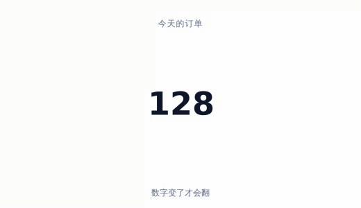
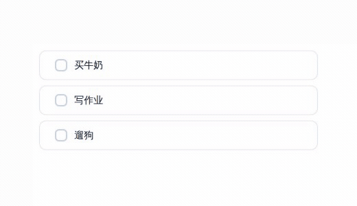
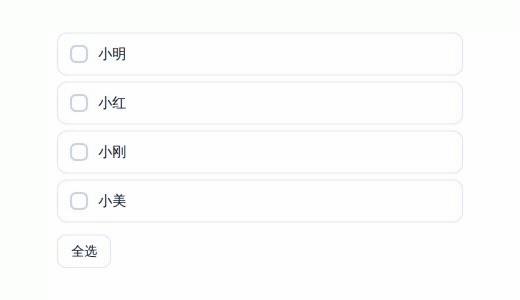
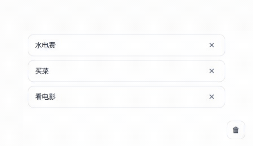
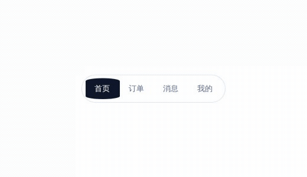
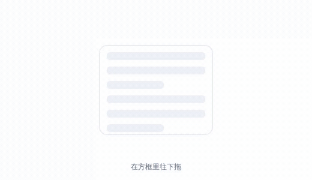
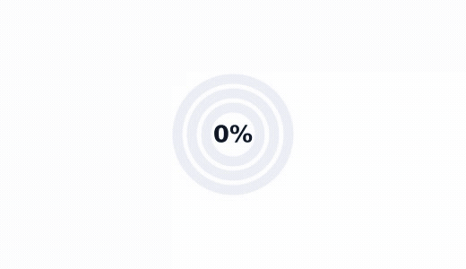
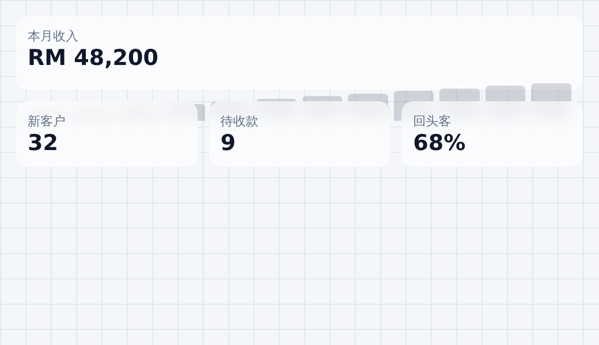
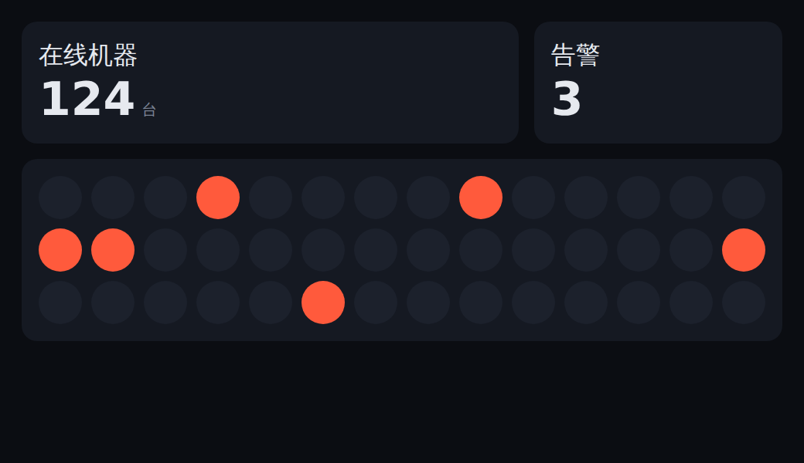

# Bryan 的设计配方库

> 一本给 AI 看的食谱：界面该怎么动、dashboard 该怎么排、AI 产品的界面该有哪些状态。
> *A recipe book that teaches AI coding agents how UI should move, how dashboards should be laid out, and what states an AI product UI needs.*

## 这是什么

你跟 AI 说「这里加点动效」，它每次都自己猜。这次弹一下，下次不弹；这个页面 0.2 秒，那个页面 0.8 秒。同一个 App 里东一块西一块，看起来就很廉价。

这个库就是一本食谱。每道菜写清楚：**什么时候用、怎么做、用什么数字、什么时候千万别用。** AI 照着做，整个项目就长一个样。

**装好之后，你只要说一句话**：「给设置页加点交互」。AI 会自己去看这个项目长什么样，挑出合适的几道菜，列给你看，你点头它才动手。

**不知道自己要什么样？** 说「帮我设计一下」就行。它会先问你几道选择题，再给你 2–3 套方案挑（下面有例子）。

---

## 它帮你做 3 件事

| | 做什么 | 里面有多少 |
|---|---|---|
| 🎬 | 让界面会动 | 54 个小动作 |
| 📐 | 帮你排 dashboard 的版 | 4 种排版方向 |
| 🤖 | 做 AI 产品的界面 | 一张「有没有漏掉」的清单 |
| 💬 | 你说不清的时候，问你几个问题再给方案 | 最多 4 道选择题 |

---

## 看效果

下面每个都是真的跑出来的，不是画的示意图。代码在 `demo/index.html`，双击就能自己玩。

### 按着按钮又后悔了，滑开就不算数


手指滑出按钮，它慢慢变回原样，松手也不会付款。滑回来还能接着按。

**什么时候用**：所有按钮。尤其是付款、删除这种按错了会哭的。

### 数字像翻牌钟，只翻变了的那一位



往上翻就是多了，往下翻就是少了。不变的数字不动，眼睛不会花。

**什么时候用**：订单数、价格、筛选结果的数量。

### 做完一件事，颜色往前推一点



背景的颜色就是进度条，不用另外再放一根。

**什么时候用**：待办清单、新手引导、一步步填的表。

### 点全选，勾一个接一个跑过去



每条差 0.03 秒。看得出是一串跑过去，而不是啪一下全亮。

**什么时候用**：全选、批量完成。

### 删掉的卡片会飞进垃圾桶



走一条弧线，一路变小变淡；垃圾桶弹一下，表示收到了。下面的卡片滑上来补位，不是瞬间跳。

**什么时候用**：删除、归档。让人知道东西去哪了。

### 底下那条会像水一样流过去



先伸长，再收回来。不是整块硬邦邦地平移。

**什么时候用**：底部导航、分段切换。

### 拉到头了，会像橡皮筋一样弹回去



越拉越重，但拉不断。松手弹回去，告诉你「到底了」。

**什么时候用**：所有能滚动的列表。比硬邦邦撞墙舒服很多。

### 圆圈从 0 画到今天的成绩



三个目标一起看，中间的数字同步长大。

**什么时候用**：dashboard 上的完成度，比如预算、收入、储蓄。

---

## 不知道要什么样？它会先问你

大多数人不知道自己想要什么设计，但一看到就知道喜不喜欢。所以它先问，最多 4 道选择题，每题都有推荐：

> **打开的第一秒，你想让人有什么感觉？**
> A 稳重可靠，像银行 App（推荐）· B 轻快好用，像手机自带的设置 · C 好玩有性格，像游戏 · D 高级安静，像美术馆

> **这一屏里最重要的一件事是什么？**
> A 看今天赚了多少 · B 赶紧回客户消息 · C 别漏掉要过期的单

问完给你 2–3 套方案，每套都写清楚**长什么样、会怎么动、什么感觉、有什么代价**：

> **方案 A：像银行 App**
> - 长什么样：白底，左边一条深色栏，全页只有一个亮色
> - 会怎么动：按钮按下缩一下、数字像翻牌钟、列表拉到底弹一下
> - 感觉：稳，不吵，数字最大
> - 代价：不会让人「哇」，但看一整天不累

你选一套，它**先做一屏**给你看。不喜欢就换一套，不用推倒重来。

还有一张「翻译表」：你说「鼠标放上去变大，旁边的让开」，它知道你要的是悬停抬起 + 邻位让位，不用你会讲专业词。

---

## 排版：一页只做一个判断

页面看起来乱，通常不是东西太多，而是**同时做了太多决定**：又加边框、又加阴影、又换颜色、又改字号，互相打架。

这里有 4 种排版方向，每种**只用一种手段**分层次。选一种，整个项目照着做。

| | |
|---|---|
| <br>**方格纸 + 玻璃卡**：只靠材质分层，不用边框和阴影。指标多、要一眼看出谁更重要时用。 | <br>**暗底，靠明暗分层**：底色接近黑，卡片亮一档就是一层。盯很久的监控屏用。 |

另外两种：**分组侧边栏**（用空白分组，不画分割线）、**一深一强调**（全页只有一块深色和一个亮色）。

---

## AI 产品的界面：有没有漏掉

做 AI 功能的时候，最容易漏掉的不是好看，是**状态**。这个库有一张清单，逐条对：

- AI 在想的时候，用户看得出它在想，不是卡死了
- 字一个个蹦出来的时候，已经出来的字不会乱跳
- 多步任务：现在第几步、哪步失败、能不能重来
- AI 要动手之前先问一句；你点同意或拒绝之后，界面都要有反应
- 回答有出处的话，要标出处
- 等待的时候别只会转圈：文字用流式、图片用从模糊到清晰、思考用步骤条

顺带还有一张图标库选型表：常规图标用 Lucide，图标要互相变（菜单 ↔ 关闭）用 Morphicons，要吸引注意的动画用 Lordicon。

---

## 剩下的 46 个是什么

动图只放了 8 个。全部 54 个分成 7 类：

| 类别 | 例子 |
|---|---|
| 页面级（8 个） | 两根手指一捏，网格在大图和列表之间切换 |
| 组件（6 个） | 几个头像叠在一起，点一下散开显示名字 |
| 图表控件（10 个） | 打卡热力格、半圆仪表盘、可以拖的目标线 |
| 手势手感（7 个） | 边缘滑回上一页、横滑竖滑不打架、甩出去的卡片半路能抓住 |
| 控件反馈（10 个） | 点一下换深色模式，深色像水波一样铺满全屏 |
| 动效质感（8 个） | 磁吸、拖起来像果冻一样变形、3D 视差 |
| 网页效果（5 个） | 鼠标放上去旁边让开、封面流、3D 环形画廊、点击涟漪、翻页 |

另外还有 7 个用真实物理引擎做的效果：掉落堆叠、爆炸散开、多米诺、标签云漂浮等等。

---

## 怎么用

1. 把这个文件夹放进 `~/.claude/skills/`（或者做个链接指过去）。
2. 在项目文件夹里打一行 **`/bryan-uiux`**，后面什么都不用带。
3. 它会自己把整件事跑完：

```
你：/bryan-uiux

它：这是一个记账后台，用 Next.js 做的网页，手机和电脑都要用。
    已经有颜色和字体的规矩（DESIGN.md），还没有动效规矩。

    打开的第一秒，你想让人有什么感觉？
    A 稳重可靠，像银行 App（推荐，因为是每天看钱的后台）
    B 轻快好用，像手机自带的设置
    C 好玩有性格，像游戏
    D 高级安静，像美术馆

你：A

它：（再问 1–2 题，然后）给你三套方案，选一套我先做一屏：
    方案 A 像银行 App …… 方案 B 像手机自带 App …… 方案 C 像监控大屏 ……

你：A

它：好，先做首页。做完给你看，不喜欢我们换。
```

**想直接点菜也行**：`/bryan-uiux 给设置页加个数字翻牌`，它就不问了，直接做。

**它每次做事的 5 步**：

| 第几步 | 它做什么 |
|---|---|
| 1 | 先认项目：这是什么产品、给谁用、手机还是网页、已经有什么设计规矩 |
| 2 | 项目还没有「动效规格」就先起草一份，**给你确认** |
| 3 | 挑 1–3 道菜，列成表**给你确认**，同类组件永远用同一道 |
| 4 | 按顺序做：先结构、再外观、最后动效 |
| 5 | 自己检查，再把这次用了什么写回规格文件 |

只有两种情况它会停下来问你：**第一次定规格**，和**要加一道新菜**。其他时候照规格自己做。

**支持**：网页、手机 App（React Native / Expo、Capacitor）、桌面 App（Electron / Tauri）。同一道菜在触屏、鼠标、键盘上怎么做，都写清楚了。

---

## 为什么不是「全部特效都上」

因为那样最难看。

每个项目先定一个「性格」：后台工作台要克制、消费 App 可以弹、品牌页可以夸张。然后**只挑合得来的那几道菜**，其余的写清楚为什么不用，下次不再争论。

一个真实的工作台项目，几十道菜里只挑了 12 道。

---

## 文件说明

| 文件 | 里面是什么 |
|---|---|
| `SKILL.md` | 总入口：怎么认项目、怎么挑、统一的数字（曲线、时长、弹性） |
| `references/page.md` | 页面级的 8 个 |
| `references/component.md` | 组件的 6 个 |
| `references/chart.md` | 图表控件的 10 个 |
| `references/gesture.md` | 手势手感的 7 个 |
| `references/feedback.md` | 控件反馈的 10 个 |
| `references/motion.md` | 动效质感的 8 个 |
| `references/physics.md` | 物理引擎的 7 种玩法和参数 |
| `references/dashboard-layouts.md` | 4 种排版方向 |
| `references/effects.md` | 网页效果 5 个 + 把大白话翻译成专业说法的对照表 |
| `references/interview.md` | 怎么问用户、怎么出方案让他选 |
| `references/platforms.md` | 网页 / 手机 / 桌面怎么分别落地 |
| `references/libraries.md` | 7 个可以直接逛的组件库 + 图标库怎么选 + AI 界面清单 |
| `references/motion-spec-template.md` | 给新项目起草「动效规格」的模板 |
| `demo/` | 上面那些例子的源码和动图 |

---

## 自己玩 / 重新录动图

```bash
# 玩：双击打开就行，不用装任何东西
open demo/index.html

# 重录动图（需要 node、ffmpeg、playwright-core）
PW=/path/to/playwright-core/index.js CHROME=/path/to/chrome node demo/record.mjs
```
